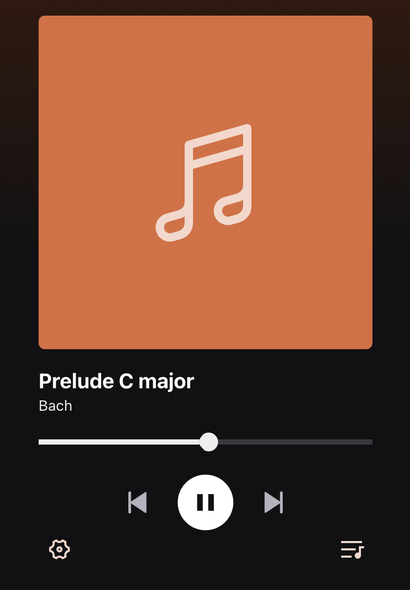

# react-candlelight

Music player that has shuffle, skip, previous and jump.



### Install

```bash
$ yarn
```

### To run it locally

```bash
$ yarn dev
```

## Background

1. Music app player that can play local files
2. A queue architecture at it's core, allowing songs to be played in shuffled loops.
3. Endless loop of songs, once the queue is cleared, a new set of songs is to be generated.
4. User can define a peek max value, of which represents the maximum number of songs they can view.

React electron was selected as the initial plan was to allow reading of system audio files.

## Tasks

1. Implement a Shuffle engine interface
2. Implement a Queue interface using a doubly linked list
3. Implement Song schema
4. ~~Use redux for state management~~ (No time)
5. Pleasant UI
6. Typescript
7. (Additional feature) Support Next, Previous, Jump features.
8. (Additional feature) Support song scrubbing and autoplay.
9. (Additional feature) ~~Support importing of system local files~~ (No time)

## Corner cases

1. If peekMax needs to be maintained, that means that for every song dequeued, a new song needs to be added to the queue.

2. peekMax as per requirement is between 1 to 100,000. Hence, potential stability issues may occur at the upper end of peekMax for expensive operations like peekQueue.

3. Architecture interfaces like shuffle engine, queue etc will need to be memoized, and hence cannot trigger a rerender on change. Function design needs to take on an imperative approach, where state updates needs to be explicit.

4. On the note of point 2, certain UI update methods needs to be in an effect so that it is not thread blocking.

## Difficulties faced

1. Unable to support importing of system local files and designing the electron file protocol handler, hence audio files are statically imported and stored in a readonly cache.

## Shuffle algorithmn

- A songId will be randomly selected from a fixed songId list. However, this algorithmn is poor and may need further optimization and work. An attempt to make each loop unique is by offering a previous song argument, and exclude that songId from the random selection. May need to explore a more robust algorithmn such as Fischer Yates.

## Architecture design

- Doubly linked list was used to achieve O(1) insertion at the head / end of the queue. Initial design utilized a singly linked list but the insert at head was O(n). Considering the range of peekMax, doubly linked list is a much better choice.

- To ensure the queue to be performant and not hold additional unnecessary data, a Song interface with only the songId and a uuId was used for the queue. When a song is loaded, the remaining song data is then fetched via songId.

```
export interface Song { // Interface used only by the Queue
  id: string
  songId: SongId
}

export interface SongData { // Full interface with song metadata
  id: string
  songId: string
  name: string
  artist: string
  src: string
  coverImg?: string
}

```

- React window (Virtual list) was used to lazy render the queue list as the peekMax range is very high.

- Hooks are used to decouple state / data operations from UI, allowing UI to be 100% responsible for view only, allowing ease of modification and maintenance.

- Uncontrolled inputs are used so that form based submission can be utilized. This allows easier form validation and maintenance.
